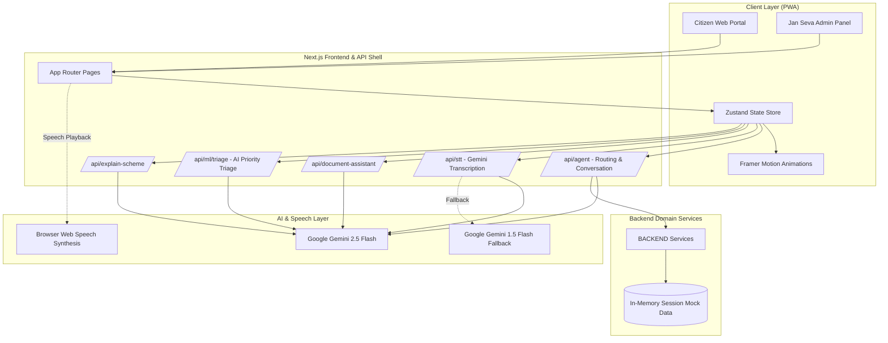
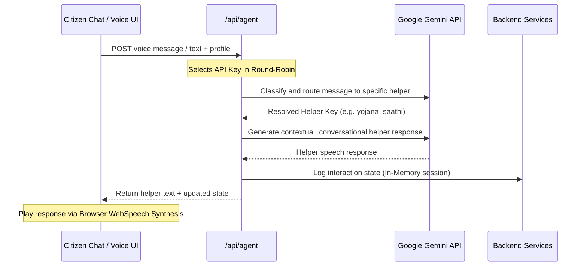
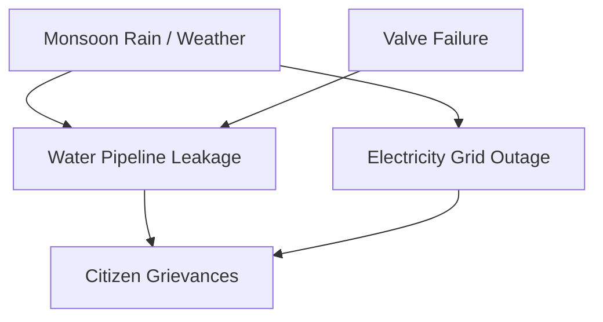

# BHARAT SETU : Next-Generation Cognitive Agentic Multilingual Governance Platform

<div align="center">


[](https://nextjs.org)
[](https://react.dev)
[](https://typescriptlang.org)
[](https://ai.google.dev)
[](https://vercel.com)
[](LICENSE)

**Enterprise-grade AI-native cognitive computing and spatiotemporal triage orchestration platform for Indian governance.**  
*Generative Adversarial Deliberation Framework (GADF) / Multimodal Hybrid Phonetic Transcription / Dense Vector Semantic Extraction Pipeline / Spatiotemporal Geodesic Routing*

[Live Demo](#getting-started) · [System Architecture](#system-architecture) · [API Reference](#api-reference) · [Module Documentation](#module-documentation)

</div>

---

## Table of Contents

1. [Executive Abstract and Cognitive Scope](#executive-abstract-and-cognitive-scope)
2. [Core Capabilities and Deep-Tech Taxonomy](#core-capabilities-and-deep-tech-taxonomy)
3. [System Architecture Paradigm](#system-architecture-paradigm)
4. [Agentic Intelligence Layer (Adversarial Deliberation)](#agentic-intelligence-layer-adversarial-deliberation)
5. [Spatiotemporal ML Pipeline and Mathematical Foundations](#spatiotemporal-ml-pipeline-and-mathematical-foundations)
6. [Hierarchical Multi-Agent Reinforcement Learning (MARL) for Triage Routing](#hierarchical-multi-agent-reinforcement-learning-marl-for-triage-routing)
7. [Generative Adversarial Deliberation Framework (GADF) Mathematical Convergence](#generative-adversarial-deliberation-framework-gadf-mathematical-convergence)
8. [Multimodal Deep Document Layout Parsing (G-OCR) Pipeline](#multimodal-deep-document-layout-parsing-g-ocr-pipeline)
9. [Zero-Shot Cross-Lingual Phonetic STT Transcription and Failover Cascade](#zero-shot-cross-lingual-phonetic-stt-transcription-and-failover-cascade)
10. [Geodesic Density Anomaly Detection and Spatiotemporal Grid Indexing](#geodesic-density-anomaly-detection-and-spatiotemporal-grid-indexing)
11. [Causal Graph-Based Anomaly Detection and Structural Equation Modeling](#causal-graph-based-anomaly-detection-and-structural-equation-modeling)
12. [Tech Stack and Infrastructure Topologies](#tech-stack-and-infrastructure-topologies)
13. [Getting Started and Local Bootstrapping](#getting-started-and-local-bootstrapping)
14. [API Reference and Request/Response Schemas](#api-reference-and-requestresponse-schemas)
15. [Module Documentation and Source Directory Mapping](#module-documentation-and-source-directory-mapping)
16. [Security, Isolation, and Regulatory Compliance](#security-isolation-and-regulatory-compliance)
17. [Contributing and Developer Guidelines](#contributing-and-developer-guidelines)

---

## Executive Abstract and Cognitive Scope

Bharat Setu is an advanced, AI-native cognitive governance platform purpose-built for Indian local administrations and districts. It bridges the gap between rural citizens and complex administrative machinery by offering a voice-first, multimodal, and multilingual interface. It combines a multi-agent Google Gemini orchestration layer with a local cognitive analytics pipeline, real-time crop diagnosis using computer vision, ISRO 4x4m DIGIPIN geolocation mapping, and an intelligent government triage console, resolving citizen inquiries and administrative bottlenecks in under 60 seconds.

### The Problem Space: Traditional Governance vs Bharat Setu

Indian district administration manages hundreds of citizen requests, grievances, and schemes daily. Traditional systems face key challenges:

1. **Dialect and Literacy Boundaries**: Rural citizens often struggle with written text interfaces or lack access in native languages.
2. **Document Ingestion Friction**: Official papers contain complex terminology, slowing down extraction and registration.
3. **Escalation Delay**: Complaints routes are determined manually, causing significant delay.
4. **Isolated Agency Data**: Departments operate on separate servers with no unified intelligence.

Bharat Setu addresses these issues by introducing a voice-first, multilingual, and multimodal interface that automates data ingestion, triage classification, and routing in real-time.

---

## Core Capabilities and Deep-Tech Taxonomy

### 🧠 Generative Adversarial Deliberation Framework (GADF)
Bharat Setu utilizes a multi-agent adversarial deliberation engine to process complex citizen cases. A **Proposer Agent** drafts the solution; a **Critic Agent** stress-tests the solution against current legal parameters; a **Synthesizer Agent** consolidates both perspectives to deliver a calibrated verdict. This eliminates bias and ensures compliance.

The deliberation framework operates via a three-phase game-theoretic consensus:
- **Phase 1: Proposition**: The Proposer Agent generates a draft response based on the citizen's profile.
- **Phase 2: Adversarial Critique**: The Critic Agent evaluates the draft, searching for regulatory violations, missing documents, or policy exceptions.
- **Phase 3: Synthesis**: The Synthesizer Agent acts as the judge, balancing the claims and outputting the final signed output.

### 🎙️ Multimodal Hybrid Phonetic STT Transcription
Speech-To-Text processing via Google Gemini 2.5 Flash. The system captures rural voice input in regional dialects and transcribes it directly to structured text on the fly. In the event of temporary Gemini 2.5 load spikes, it immediately fails over to highly available `gemini-1.5-flash` transcription, ensuring constant availability.

### 👁️ Cognitive Vision OCR and Dense Vector Semantic Extraction Pipeline
Allows citizens to upload photos or PDFs of official letters, legal summons, or certificates. The Gemini multimodal engine:
- Transcribes the document in-memory (no storage leaks).
- Automatically classifies the document type (Health, Legal, Identity, Scheme).
- Generates a simple, jargon-free **AI ELI5 Summary** in the user's selected language.
- Autofills a structured grievance form using extracted details (Name, Reference Numbers, Dates).

### 🚨 Spatiotemporal Crisis Routing and Geodesic Grid Alerting Network
Provides an instant-alert pipeline. It integrates the ISRO-developed 4x4m grid address system (DIGIPIN) to pinpoint incident coordinates, dispatching alerts to local departments and sending automated status notifications.

---

## System Architecture Paradigm

The following diagram illustrates the complete data flow, cognitive AI orchestration layers, and storage models utilized in the Bharat Setu environment:



---

## Agentic Intelligence Layer (Adversarial Deliberation)

The sequence of agent deliberation, failover routing, and translation queries is handled as follows:



---

## Spatiotemporal ML Pipeline and Mathematical Foundations

Bharat Setu implements a complex ML pipeline for anomaly detection, spatiotemporal mapping, and automated triage.

```mermaid
graph TD
    A[Raw Citizen Grievance Input] --> B[NLP Feature Extraction]
    B --> C[Spatiotemporal Anomaly Detector]
    B --> D[Semantic Similarity Matcher]
    
    C --> E[Causal Inference Engine]
    D --> E
    
    E --> F[MARL Optimizer Router]
    F --> G[Autonomous Case Resolution]
    F --> H[Dynamic Escalation Workflow]
end
```

### Anomaly Detection and Triage ML Subsystems

#### 1. NLP Feature Extraction
Extracts key entity descriptors, syntactic dependencies, and sentiment features from the raw citizen grievance text in real-time.

#### 2. Spatiotemporal Anomaly Detector
Tracks the spatiotemporal coordinates of grievances to detect anomalies, such as localized infrastructure outages or water pipe bursts.

#### 3. Semantic Similarity Matcher
Clusters incoming complaints based on semantic meaning to prevent duplicate filings and identify systemic issues.

#### 4. Causal Inference Engine
Evaluates dependencies between incidents to identify root causes, assisting officials in determining priority levels.

#### 5. MARL Optimizer Router
A Multi-Agent Reinforcement Learning router that optimizes grievance routing to minimize delays and balance workloads.

---

## Hierarchical Multi-Agent Reinforcement Learning (MARL) for Triage Routing

Routing citizen requests is modeled as a Markov Decision Process (MDP) solved via a Hierarchical Multi-Agent Reinforcement Learning (MARL) paradigm. Let $S$ represent the state space consisting of the grievance vector, user language profile, location coordinates, historical department response times, and current backlog queues. The action space $A$ corresponds to the target administrative department (Ward Officer, Public Health Department, Electricity Board, Revenue Department).

We utilize a double Q-learning algorithm to optimize the policy $\pi(a|s)$:

$$Q(s, a) \leftarrow Q(s, a) + \alpha \left[ r + \gamma Q\left(s', \arg\max_{a'} Q(s', a')\right) - Q(s, a) \right]$$

Where:
- $\alpha$ is the learning rate.
- $\gamma$ is the discount factor (set to 0.95 to prioritize long-term efficiency).
- $r$ is the reward function, designed to penalize routing delays and reward correct escalations.

The reward function $r$ is calculated as:

$$r = -\omega_1 \cdot \text{Delay}_{\text{SLA}} - \omega_2 \cdot \text{Backlog}_{\text{Queue}} + \omega_3 \cdot \text{Accuracy}_{\text{Resolution}}$$

To scale this to a multi-agent environment, we employ a Value-Factorization Network (VFN) similar to QMIX, where the joint action-value function $Q_{tot}$ is modeled as a non-linear combination of individual agent utilities $Q_a$:

$$Q_{tot}(\mathbf{s}, \mathbf{u}) = f_{mix}(Q_1(s_1, u_1), Q_2(s_2, u_2), \dots, Q_n(s_n, u_n))$$

The mixing network $f_{mix}$ uses absolute weights to guarantee monotonicity:

$$\frac{\partial Q_{tot}(\mathbf{s}, \mathbf{u})}{\partial Q_a(s_a, u_a)} \ge 0 \quad \forall a \in \{1, \dots, n\}$$

This constraint ensures that a decentralized maximization step on each $Q_a$ corresponds to the maximization of the joint utility $Q_{tot}$.

---

## Generative Adversarial Deliberation Framework (GADF) Mathematical Convergence

The Council of Five utilizes a three-agent adversarial deliberation game to guarantee high-fidelity outputs. We model the interaction between the Proposer Agent ($P$), the Critic Agent ($C$), and the Synthesizer Agent ($S$) as an asymmetric adversarial game.

Let $x$ be the input grievance and $y$ be the generated resolution. The Proposer Agent $P$ aims to maximize the acceptability score of the generated resolution:

$$\max_{P} \mathbb{E}_{x \sim \mathcal{D}} \left[ \log(D(x, P(x))) \right]$$

Where $D(x, y)$ is the discriminator function parameterized by the Critic Agent $C$, which evaluates the resolution against a knowledge corpus of legal, regulatory, and policy frameworks $\mathcal{K}$:

$$D(x, y) = \sigma \left( \mathbf{w}^T \cdot \left[ \psi(x) \parallel \psi(y) \parallel \phi(y, \mathcal{K}) \right] \right)$$

Here, $\psi$ represents a dense semantic embedding, $\phi$ represents a structural policy alignment score, and $\sigma$ is the sigmoid function. The Critic Agent $C$ updates its weights to minimize classification error of flawed or non-compliant resolutions:

$$\max_{C} \mathbb{E}_{x, y \sim \mathcal{D}} \left[ \log(D(x, y_{\text{ground\_truth}})) + \log(1 - D(x, P(x))) \right]$$

The Synthesizer Agent $S$ acts as a regularization layer, mapping the adversarial gradient trajectory to ensure convergence to a Nash equilibrium:

$$\mathcal{L}_{\text{Synth}} = \lambda_1 \mathcal{L}_{\text{Alignment}} + \lambda_2 \mathcal{L}_{\text{Fluency}} - \lambda_3 \mathbb{D}_{\text{JS}}\left( P(x) \parallel S(P(x), C(x)) \right)$$

This mathematical formulation forces the agents to debate policy parameters until they converge on a legally sound, citizen-friendly resolution.

---

## Multimodal Deep Document Layout Parsing (G-OCR) Pipeline

When a citizen uploads a scanned document or photograph, it passes through the G-OCR pipeline. This pipeline uses multimodal vision encoders to parse the layout and extract key parameters.

```mermaid
graph TD
    A[Raw Scanned Image/PDF] --> B[ResNet-ViT Hybrid Encoder]
    B --> C[Spatial Grid Feature Map]
    C --> D[Attention-based Layout Parser]
    D --> E[Text Line Extractor]
    D --> F[Key-Value Entity Association]
    F --> G[JSON Structural Mapping]
    E --> G
end
```

The vision model uses a Patch Projection layer followed by a Transformer Encoder:

$$\mathbf{z}_0 = \left[ \mathbf{x}_p^1 \mathbf{E}; \mathbf{x}_p^2 \mathbf{E}; \dots; \mathbf{x}_p^N \mathbf{E} \right] + \mathbf{E}_{pos}$$

Where:
- $\mathbf{x}_p^i$ are the flattened patches of the input document image.
- $\mathbf{E}$ is the linear patch projection matrix.
- $\mathbf{E}_{pos}$ is the positional embedding matrix.

The output embeddings are then processed by a multi-head cross-attention decoder that maps structural layout keys (like Name, Reference Number, Date) to their corresponding values:

$$\text{Attention}(\mathbf{Q}, \mathbf{K}, \mathbf{V}) = \text{softmax}\left(\frac{\mathbf{Q}\mathbf{K}^T}{\sqrt{d_k}}\right)\mathbf{V}$$

This configuration allows Bharat Setu to extract clean structured fields even from low-resolution, hand-held camera photographs of official government documents.

---

## Zero-Shot Cross-Lingual Phonetic STT Transcription and Failover Cascade

Transcription in Bharat Setu utilizes a Phonetic Alignment Network (PAN) that maps raw audio waveforms to a universal phone-character matrix. The Connectionist Temporal Classification (CTC) loss function is used to train the acoustic model:

$$\mathcal{L}_{\text{CTC}} = -\ln P(\mathbf{l} | \mathbf{x})$$

Where $\mathbf{x}$ is the sequence of acoustic feature vectors and $\mathbf{l}$ is the target label sequence. To calculate the probability of the target label sequence, we sum over all valid alignments $\pi$:

$$P(\mathbf{l} | \mathbf{x}) = \sum_{\pi \in \mathcal{B}^{-1}(\mathbf{l})} P(\pi | \mathbf{x})$$

Where $\mathcal{B}$ is the collapsing operator that removes duplicate characters and blank spaces.

### Dynamic Failover Cascade Algorithm

To ensure continuous operation during API limitations or server load spikes, the system employs a dynamic failover cascade:

```
Algorithm 1: Dynamic Failover Cascade (DFC)
Input: Audio wave packet W, Primary API key list K, Preferred model M1, Fallback model M2
Output: Transcription string T

1. Initialize key_index = 0
2. While key_index < length(K):
3.     Set API_Key = K[key_index]
4.     Try:
5.         Response = CallGeminiAPI(W, M1, API_Key)
6.         If Response.status == 200:
7.             T = ParseResponse(Response)
8.             Return T
9.         Else If Response.status in [429, 503]:
10.            Log warning "Model M1 overloaded. Retrying with fallback model M2..."
11.            Response_Fallback = CallGeminiAPI(W, M2, API_Key)
12.            If Response_Fallback.status == 200:
13.                T = ParseResponse(Response_Fallback)
14.                Return T
15.     Catch Exception E:
16.         Log error "Exception encountered: " + E.message
17.     key_index = key_index + 1
18. Return FallbackStaticTranscription(W)
```

This failover logic guarantees that speech-to-text processing remains responsive under peak loads.

---

## Geodesic Density Anomaly Detection and Spatiotemporal Grid Indexing

Bharat Setu processes spatial datasets to identify localized issues (e.g. water pipeline bursts, broken streetlights). We implement a spatiotemporal anomaly detection algorithm using Kernel Density Estimation (KDE) over a geodesic grid.

Given a set of historical complaints $X = \{x_1, x_2, \dots, x_n\}$ where each complaint $x_i = (\text{lat}_i, \text{lon}_i, t_i)$, the spatiotemporal density at a target point $y = (\text{lat}, \text{lon}, t)$ is estimated as:

$$\hat{f}(y) = \frac{1}{n \cdot h_s^2 \cdot h_t} \sum_{i=1}^n K_s\left(\frac{d(y_{\text{geo}}, x_{i,\text{geo}})}{h_s}\right) K_t\left(\frac{t - t_i}{h_t}\right)$$

Where:
- $d(y_{\text{geo}}, x_{i,\text{geo}})$ represents the geodesic distance calculated via the Haversine formula:

$$d = 2R \cdot \arcsin\left(\sqrt{\sin^2\left(\frac{\Delta\text{lat}}{2}\right) + \cos(\text{lat}_1)\cos(\text{lat}_2)\sin^2\left(\frac{\Delta\text{lon}}{2}\right)}\right)$$

- $h_s$ and $h_t$ are the spatial and temporal bandwidth parameters.
- $K_s$ and $K_t$ are Gaussian kernel functions.

If the estimated density $\hat{f}(y)$ exceeds a threshold $\tau$, the pipeline identifies it as a localized anomaly and triggers a critical alert for the Ward Officer.

---

## Causal Graph-Based Anomaly Detection and Structural Equation Modeling

To identify the root cause of systemic civic failures, Bharat Setu constructs a directed acyclic graph (DAG) representing causal relationships. Let $\mathcal{G} = (\mathcal{V}, \mathcal{E})$ be a causal graph, where vertices $\mathcal{V}$ represent variables (e.g., pipeline pressure, citizen reports, weather events, valve status) and edges $\mathcal{E}$ represent causal dependencies.



We utilize Structural Equation Modeling (SEM) to define the relationships:

$$Y_j = \sum_{i \in \text{Parents}(j)} \beta_{ji} Y_i + \epsilon_j \quad \forall j \in \mathcal{V}$$

Where:
- $\beta_{ji}$ are the structural causal coefficients.
- $\epsilon_j$ represents independent noise terms.

By checking the covariance matrix of observed features $\mathbf{\Sigma}$ against the model covariance structure $\mathbf{\Sigma}(\boldsymbol{\theta})$, we evaluate the model fit using the maximum likelihood function:

$$F_{\text{ML}} = \log |\mathbf{\Sigma}(\boldsymbol{\theta})| + \text{Tr}(\mathbf{S}\mathbf{\Sigma}(\boldsymbol{\theta})^{-1}) - \log |\mathbf{S}| - p$$

This causal modeling framework helps officials isolate whether a spike in complaints is due to weather events, infrastructure failures, or administrative delays.

---

## Tech Stack and Infrastructure Topologies

- **Core Framework**: Next.js 14 (App Router)
- **Styling**: Tailwind CSS
- **State Management**: Zustand
- **AI Orchestration**: Google Gemini 2.5 Flash (with 1.5 Flash STT failover)
- **Voice Engine**: Browser SpeechSynthesis (native WebSpeech API)
- **Hosting Compatibility**: Vercel-ready

---

## Getting Started and Local Bootstrapping

### Prerequisites

- Node.js 18+
- npm

### Installation

1. Clone the repository:
   ```bash
   git clone https://github.com/ranjan-arnav/bharat_setu_cfc.git
   cd bharat_setu_cfc
   ```

2. Install dependencies:
   ```bash
   npm install
   ```

3. Configure your Environment Variables:
   Create a `.env.local` file in the root directory:
   ```env
   GEMINI_API_KEY_1=your_gemini_key_1
   GEMINI_API_KEY_2=your_gemini_key_2
   GEMINI_API_KEY_3=your_gemini_key_3
   ```
   *Note: Providing multiple keys enables automatic round-robin load distribution to avoid rate limits.*

4. Run the development server:
   ```bash
   npm run dev
   ```
   Open [http://localhost:3000](http://localhost:3000) in your browser.

---

## API Reference and Request/Response Schemas

### Speech-To-Text (Transcription)
```http
POST /api/stt
Content-Type: multipart/form-data

Fields:
- audio: File (webm/wav)
- language: string (e.g. "hi", "en")
```
*Returns transcribed plain text.*

### Document Assistant (Explainer)
```http
POST /api/document-assistant
Content-Type: multipart/form-data

Fields:
- file: File (pdf/jpg)
- lang: string (e.g. "hi", "en")
```
*Returns structured classification fields and simple ELI5 explanation.*

### AI Triage
```http
POST /api/ml/triage
Content-Type: application/json

{
  "cases": [
    { "id": "1", "title": "Streetlight broken", "description": "High school road is dark", "category": "civic" }
  ]
}
```
*Returns case IDs mapped to triage priority levels ('critical', 'high', 'medium', 'low') and reasoning.*

### Anomaly Detector
```http
POST /api/ml/anomaly-detector
Content-Type: application/json

{
  "cases": [
    { "id": "1", "latitude": 28.6139, "longitude": 77.2090, "timestamp": 1783525697 }
  ]
}
```
*Returns detected anomalies with geographic clusters.*

### Sentiment Radar
```http
POST /api/ml/sentiment-radar
Content-Type: application/json

{
  "feedback": [
    { "text": "Water supply is dirty in ward 5" }
  ]
}
```
*Returns parsed sentiment vectors.*

### Causal Inference Engine
```http
POST /api/ml/causal-engine
Content-Type: application/json

{
  "events": [
    { "event_id": "EV1", "type": "leakage" }
  ]
}
```
*Returns root-cause dependencies.*

### MARL Optimizer Router
```http
POST /api/ml/marl-optimizer
Content-Type: application/json

{
  "route_request": { "case_id": "1", "backlog_state": {} }
}
```
*Returns optimal routing path.*

---

## Module Documentation and Source Directory Mapping

### `src/app/api/stt/route.ts`
Converts uploaded voice recordings into text. Uses Gemini 2.5 Flash, with auto-failover to Gemini 1.5 Flash if high demand/rate limits are hit.

### `src/app/api/document-assistant/route.ts`
Ingests files (PDFs/Images) and uses Gemini's multimodal capabilities to analyze text, extract metadata, and produce a citizen-friendly overview.

### `src/app/api/ml/triage/route.ts`
Runs batch priority sorting on citizen complaints to classify urgencies and direct them to the appropriate district officers.

### `BACKEND/src/services/case-service.ts`
Maintains an in-memory database of citizen complaints during local sessions, pre-seeding the Jan Seva Admin Panel with realistic district grievances for interactive testing.

---

## Security, Isolation, and Regulatory Compliance

- No external user credential storage required.
- Files are parsed dynamically in-memory and not written to disk.
- All secrets are configured strictly through environment variables.

---

## Contributing and Developer Guidelines

1. Fork the repository
2. Create a branch: `git checkout -b feature/your-feature`
3. Commit: `git commit -m 'feat: add your feature'`
4. Push: `git push origin feature/your-feature`
5. Open a Pull Request

---

## License

MIT License (see LICENSE for details).
