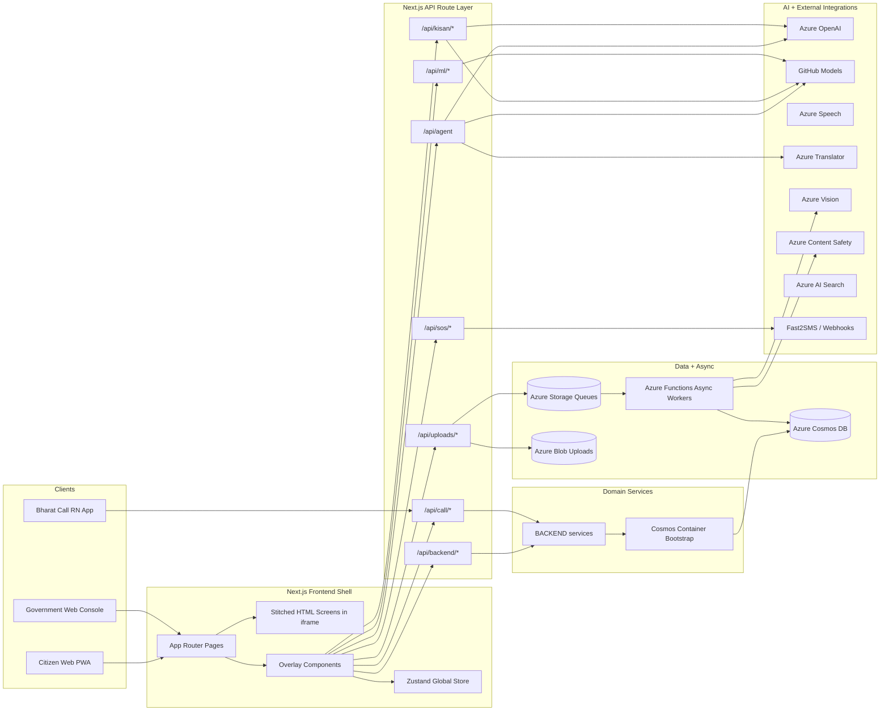
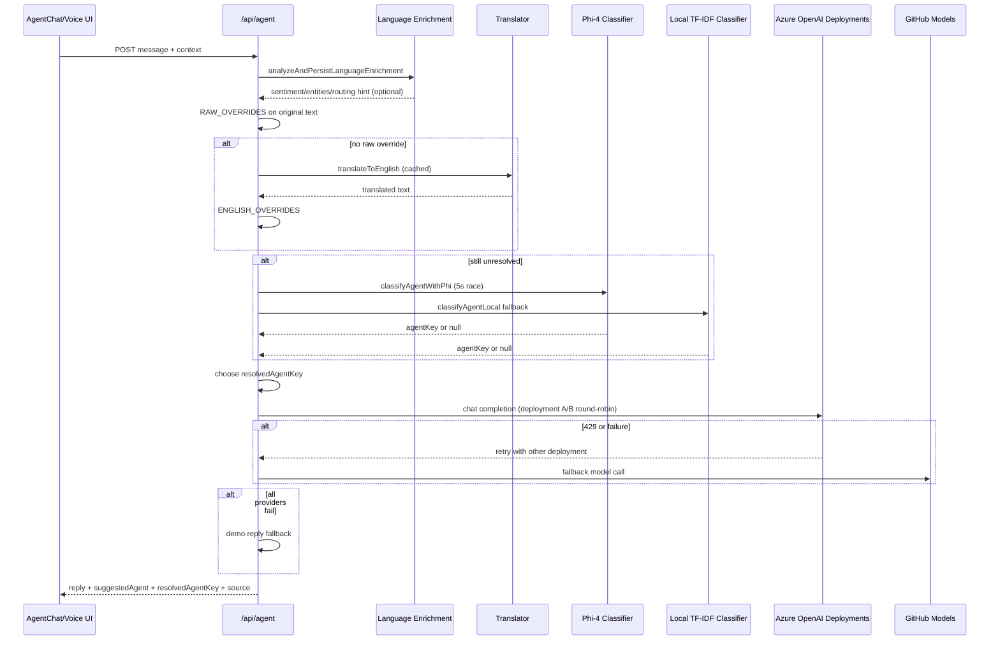
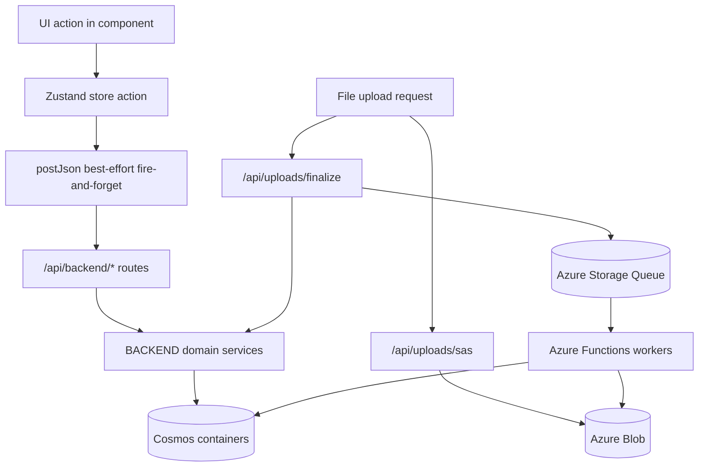
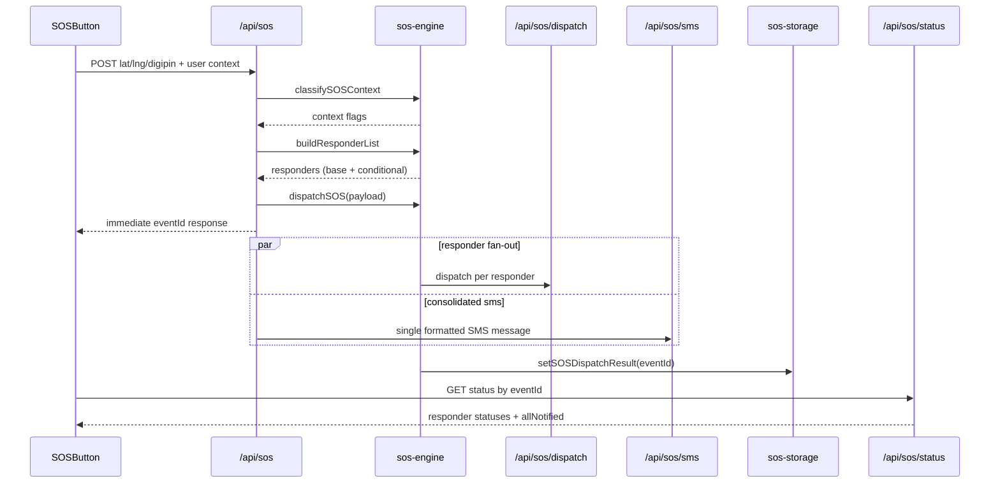

# Bharat Setu - Deep Technical README


[](https://nextjs.org)
[](https://react.dev)
[](https://www.typescriptlang.org)
[](https://azure.microsoft.com)

## What This README Is

This is a deep architecture and implementation README for the full `D:\newbs\bharat-setu` workspace subtree.

It is intended for:
- New engineers onboarding into the codebase
- Architects reviewing data flow and deployment topology
- Contributors extending routes, state, or Azure integrations

## Analysis Scope (This Pass)

Static analysis completed over the `bharat-setu/bharat-setu` project root:

- Total non-generated files scanned (excluding `.git`, `.next`, `node_modules`): `303`
- Text/config/docs/source files scanned: `275`
- Total scanned text lines: `205,976`
- Focused runtime code/assets (`src`, `BACKEND`, `azure-functions/async-workers`, `public/screens`):
  - Files: `168`
  - Lines: `51,307`

Important: this repository contains large diagnostic artifacts (`real_lint_errors.txt`, `real_lint_utf8.txt`) that dominate raw line counts; this README focuses on executable source architecture and supporting docs.

## High-Level Overview

Bharat Setu is a multilingual governance platform composed of:
- A Next.js 14 App Router web app (`bharat-setu/bharat-setu`)
- API route handlers for agent orchestration, civic workflows, SOS, and analytics
- Cosmos-backed backend domain services under `BACKEND/src/services`
- Optional Azure Functions queue workers for asynchronous enrichment/processing
- A React Native companion app (`bharat-call-rn`) integrating through call-handoff endpoints

Primary product capabilities:
- Council of Five AI assistants (civic, health, schemes, finance, legal)
- Voice input/output (STT/TTS) in Indian language contexts
- Grievance filing and tracking
- Scheme discovery and guidance
- DIGIPIN + SOS alerting pipeline
- Government dashboards (alerts, analytics, case oversight)

## System Architecture Diagram



## Detailed Diagram 1 - Agent Routing + LLM Fallback Chain



## Detailed Diagram 2 - Persistence + Async Job Pipeline



## Detailed Diagram 3 - SOS Emergency Dispatch Flow



## Repository Structure (Practical)

```text
bharat-setu/
  package.json                   # minimal root package (workspace-level)
  project_explained.md
  bharat-setu/                   # actual Next.js app root
    src/
      app/
        page.tsx                 # main shell + overlay orchestration
        api/                     # all route handlers
        actions/                 # server actions helper(s)
      components/                # feature overlays + gov modules + kisan screens
      lib/                       # store, AI config, SOS engine, telemetry, async libs
    BACKEND/
      src/
        cosmos-backend.ts
        services/                # domain services for persistence + analytics
    azure-functions/
      async-workers/             # queue workers (optional deployment)
    public/
      screens/                   # stitched HTML screen assets
```

## Frontend Runtime Architecture

Main shell: `src/app/page.tsx`

Key runtime patterns:
- Uses a hybrid UI: static stitched screen HTML in iframe + React overlays
- Main state source is a single Zustand store (`src/lib/store.ts`)
- Overlay mode drives active workflows: chat, grievance, schemes, voice, SOS, impact, digipin, tracking, emergency contacts
- Government and citizen views diverge by `userType` and onboarding state
- Profile and translation data are injected into iframe via postMessage and direct DOM updates (same-origin)

Major component groups:
- Citizen overlays: `AgentChat`, `GrievanceForm`, `SchemeScanner`, `VoiceAssistant`, `SOSButton`, `TrackCasesOverlay`, `ImpactDashboard`
- Government modules: `GovDashboard`, `GovCaseManagement`, `GovAnalytics`, `GovAlerts`, `GovAdmin`
- Domain surfaces: `CivicDigitalTwin`, `DigipinLocator`, `EmergencyContactsManager`, `KisanMitra` screen set

## State Management (Zustand) - `src/lib/store.ts`

Core slices include:
- Auth/session: `isAuthenticated`, `userType`, `role`, onboarding completion
- Agent chat: per-agent histories + active agent
- Profile: lightweight `userProfile` + rich `citizenProfile`
- Tracking: `trackedItems`, status updates, badge counters
- Voice + overlays + notifications + karma/rewards
- Collective action clusters + form state

Persistence pattern:
- Store updates are immediate and local
- Backend sync is best-effort (`postJson`) and intentionally non-blocking
- Writes fan out to:
  - `/api/backend/profiles`
  - `/api/backend/messages`
  - `/api/backend/cases`
  - `/api/backend/scheme-applications`

## Backend Domain Layer (`BACKEND/src/services`)

Design pattern:
- Route handlers remain thin wrappers
- All Cosmos logic lives in services
- Validation and errors are normalized via `BackendHttpError`

Main service responsibilities:
- `profile-service.ts`: upsert/fetch profile records
- `message-service.ts`: chat message persistence by conversation
- `case-service.ts`: citizen and government case queries + upsert
- `scheme-application-service.ts`: application lifecycle persistence
- `sos-session-service.ts`: SOS session metadata
- `sos-event-service.ts`: event timeline records with optional TTL
- `citizen-alert-service.ts`: governance broadcast advisories
- `analytics-service.ts`: aggregated gov analytics and report intelligence
- `civic-twin-graph-service.ts`: predictive civic warning graph
- `reset-session-service.ts`: cloud state purge across containers

## Cosmos Containers + Partition Design

Container map from `BACKEND/src/cosmos-backend.ts`:

- `profiles` -> partition `/userId`
- `messages` -> partition `/conversationId`, TTL default 14 days
- `sosSessions` -> partition `/userId`
- `sosEvents` -> partition `/sessionId`, TTL default 7 days
- `cases` -> partition `/userId`
- `schemeApplications` -> partition `/userId`
- `enrichments` -> partition `/userId`, TTL default 14 days
- `uploads` -> partition `/userId`, TTL default 30 days
- `asyncJobs` -> partition `/userId`, TTL default 14 days
- `clusterAnalytics` -> partition `/userId`, TTL default 30 days
- `notificationAnalytics` -> partition `/userId`, TTL default 30 days
- `citizenAlerts` -> partition `/scopeId`, TTL default 14 days

## API Catalog (Complete Route Inventory)

### Core Assistant + Media

- `POST /api/agent` - multi-step agent routing + response generation
- `POST /api/voice` - TTS and speech token issuance (`action=tts|token`)
- `POST /api/stt` - speech-to-text transcription
- `POST /api/translate` - text translation with passthrough fallback
- `POST /api/vision-chat` - image caption/tags/objects context
- `POST /api/content-safety` - text moderation check
- `GET /api/health` - service health

### Governance Backend Persistence

- `GET,POST /api/backend/profiles`
- `GET,POST /api/backend/messages`
- `GET,POST /api/backend/cases`
- `GET,POST /api/backend/scheme-applications`
- `GET,POST /api/backend/sos-sessions`
- `GET,POST /api/backend/sos-events`
- `GET,POST /api/backend/citizen-alerts`
- `GET /api/backend/analytics`
- `GET /api/backend/civic-twin-graph`
- `POST /api/backend/reset-session`

### SOS + Emergency

- `POST,GET /api/sos`
- `POST /api/sos/dispatch`
- `POST /api/sos/end`
- `POST /api/sos/sms`
- `GET /api/sos/status`
- `POST /api/sos/update-location`

### Call Handoff (Web <-> RN)

- `POST /api/call/handoff`
- `GET /api/call/ring/poll`
- `POST /api/call/ring/trigger`

### Upload + Document Pipeline

- `POST /api/uploads/sas`
- `POST /api/uploads/finalize`
- `POST /api/document-assistant`

### Scheme + News Explainers

- `POST /api/schemes`
- `POST /api/explain-scheme`
- `POST /api/explain-news`
- `POST /api/summarize-news`
- `POST /api/generate-form`

### Kisan Domain

- `POST /api/kisan/recommend`
- `POST /api/kisan/diagnosis`
- `GET /api/kisan/market`
- `POST /api/kisan/mandi`
- `POST /api/kisan/distance`
- `POST /api/kisan/tts`

### Intelligence + ML Utility Routes

- `POST /api/intelligence/multi-agent`
- `POST /api/ml/triage`
- `POST /api/ml/auth-anomaly`
- `POST /api/ml/auto-resolve`
- `POST /api/ml/broadcast-ai`
- `POST /api/ml/duplicate-detector`
- `POST /api/ml/performance-analyze`
- `POST,GET /api/ml/knowledge-graph`
- `GET /api/ml/anomaly-detector`
- `GET /api/ml/causal-engine`
- `GET /api/ml/intelligence-engine`
- `GET /api/ml/marl-optimizer`
- `GET /api/ml/scheme-leakage`
- `GET /api/ml/sentiment-radar`
- `GET /api/ml/spatiotemporal`

## Agent Orchestration Deep Notes

`src/app/api/agent/route.ts` is the largest control plane module and includes:

- Language-aware routing heuristics (raw-script and translated English overrides)
- Optional language enrichment persistence (`azure-language-enrichment`)
- Multi-provider model cascade:
  - Azure OpenAI deployment A/B (round-robin)
  - GitHub Models fallback
  - deterministic demo fallback responses
- Specialized response shaping for legal and finance assistants
- Grounded RAG integration (`azure-rag`) with confidence thresholding and fallback answers

## SOS Engine Deep Notes

`src/lib/sos-engine.ts` implements:

- DIGIPIN encode/decode
- Context classification flags (`requiresWomenSafety`, `requiresChildSafety`, `requiresDisasterResponse`, `requiresCyberCrime`)
- Dynamic responder list synthesis
- Single-responder dispatch abstraction with channel strategy (`api`, `sms`, `webhook`, `call`)
- Concurrent fan-out dispatch and per-responder status collection
- Offline SMS deep-link helper

`/api/sos` complements engine dispatch by:
- validating inbound coordinates/digipin
- triggering fan-out asynchronously
- sending one consolidated SMS payload via `/api/sos/sms`
- returning immediate `eventId` for polling

## Call Handoff + RN Integration

`/api/call/handoff`:
- validates requested agent
- normalizes mobile format
- compacts conversation context
- emits continuation token + deep link
- dispatches ring via webhook and/or local queue fallback

`/api/call/ring/poll`:
- RN app polling endpoint (default channel: `local-rn`)

Queue storage behavior (`src/lib/call-handoff-store.ts`):
- in-memory queue with TTL (2 minutes)
- Cosmos fallback persistence if configured

## Async Processing Subsystem

Optional worker app: `azure-functions/async-workers`

Queue consumers:
- cluster worker
- notify worker
- postprocess worker
- scan-classify worker

Job lifecycle:
- status transitions in Cosmos `asyncJobs`
- upload status transitions in Cosmos `uploads`
- analytics side writes to `clusterAnalytics` and `notificationAnalytics`

Processor enrichments include:
- sentiment scoring via Azure Language (or fallback)
- image caption/tags via Azure Vision (when configured)
- content risk scoring via Azure Content Safety (when configured)

## Data Models (Practical Summary)

Primary domain objects persisted through backend routes/services:

- Profile
  - keys: `id=profile:{userId}`, `userId`, `userProfile`, `citizenProfile`, timestamps
- Message
  - keys: `id(uuid)`, `conversationId=userId:agentKey`, `role`, `content`, `createdAt`
- Case
  - keys: `id(caseId)`, `userId`, `category`, `status`, `metadata`, timestamps
- Scheme Application
  - keys: `id(applicationId)`, `userId`, `workflowStage`, `notes`, timestamps
- SOS Session/Event
  - session metadata under `sosSessions`, event timeline under `sosEvents`
- Citizen Alert
  - scoped advisory records (`scopeId`, `category`, `priority`, `expiresAt`)
- Async Job / Upload
  - queue-backed lifecycle records and scan metadata

## External Dependencies and Integrations

AI and speech:
- Azure OpenAI
- GitHub Models
- Azure Speech
- Azure Translator
- Azure Vision
- Azure Content Safety
- Azure AI Search

Data and storage:
- Azure Cosmos DB
- Azure Blob Storage
- Azure Storage Queue

Other integrations:
- Fast2SMS
- Webhook-based notification channels
- OpenStreetMap (reverse geocoding)

## Security + Resilience Patterns

Observed patterns across the codebase:

- Fail-soft behavior when Azure config is missing (demo or bypass fallback)
- SSML/XML escaping in TTS route to avoid injection in generated speech payloads
- Route-level telemetry instrumentation for important APIs
- Best-effort backend synchronization from store to avoid UI lockups
- TTL usage in Cosmos containers for cost and lifecycle control
- Multi-provider AI fallback chain to mitigate quota/rate-limit failures

## Build, Run, and Deploy

Project root for runtime commands:
- `bharat-setu/bharat-setu`

Main scripts:
- `npm run dev`
- `npm run build`
- `npm run start`
- `npm run lint`

Deployment assets:
- `Dockerfile` (multi-stage, standalone output, healthcheck on `/api/health`)
- `netlify.toml` (Next.js plugin build path)
- `azure-deploy.ps1`, `deploy.sh` (deployment helpers)
- `next.config.js` includes `serverActions.allowedOrigins` expansion for tunnel/dev domains

## Environment Variables (Grouped)

Required by feature area:

- Core AI:
  - `AZURE_OPENAI_ENDPOINT`
  - `AZURE_OPENAI_API_KEY`
  - `AZURE_OPENAI_DEPLOYMENT`
  - `AZURE_OPENAI_DEPLOYMENT_B`
  - `GITHUB_TOKEN`
  - `GITHUB_TOKEN_PHI`
  - `GITHUB_TOKEN_MINISTRAL`

- Speech and translation:
  - `AZURE_SPEECH_KEY`
  - `AZURE_SPEECH_REGION`
  - `AZURE_TRANSLATOR_KEY`
  - `AZURE_TRANSLATOR_REGION`

- Vision/safety/search:
  - `AZURE_VISION_ENDPOINT`
  - `AZURE_VISION_KEY`
  - `AZURE_CONTENT_SAFETY_ENDPOINT`
  - `AZURE_CONTENT_SAFETY_KEY`
  - `AZURE_SEARCH_ENDPOINT`
  - `AZURE_SEARCH_KEY`
  - `AZURE_SEARCH_INDEX`

- Data + async:
  - `COSMOSDB_ENDPOINT`
  - `COSMOSDB_KEY`
  - `COSMOSDB_DATABASE`
  - `AZURE_STORAGE_CONNECTION_STRING`
  - `ASYNC_QUEUE_CLUSTER_NAME`
  - `ASYNC_QUEUE_NOTIFY_NAME`
  - `ASYNC_QUEUE_POSTPROCESS_NAME`
  - `ASYNC_QUEUE_SCAN_NAME`

- Observability:
  - `APPLICATIONINSIGHTS_CONNECTION_STRING`
  - `APPINSIGHTS_ROLE_NAME`
  - `APPINSIGHTS_SAMPLING_PERCENTAGE`

- Call handoff and SOS:
  - `MOBILE_CALL_RING_WEBHOOK_URL`
  - `MOBILE_CALL_DEEPLINK_BASE`
  - `MOBILE_CALL_DEVICE_CHANNEL`
  - `MOBILE_CALL_FALLBACK_NUMBER`
  - `FAST2SMS_API_KEY`

## Known Characteristics / Engineering Notes

- Codebase is intentionally fallback-heavy to keep demo/dev experience resilient
- A few modules are large and multi-responsibility (notably `src/app/api/agent/route.ts`, `AgentChat.tsx`, `Onboarding.tsx`)
- There is a clear separation between route handlers and backend domain services
- Async pipeline is present both in Next app and dedicated Azure Functions workers
- i18n corpus is extensive (`src/lib/i18n/translations.ts`)

## Recommended Next Improvements

1. Split `src/app/api/agent/route.ts` into composable strategy modules (routing, legal formatter, finance formatter, provider adapters).
2. Centralize provider clients with shared retry/circuit-breaker policy.
3. Add contract tests for all `/api/backend/*` routes against mock Cosmos containers.
4. Move polling-based call handoff to event push/WebSocket where infra allows.
5. Add OpenAPI-style generated route docs from source to keep this inventory auto-synced.

---

If you are onboarding: start with `src/app/page.tsx`, then `src/lib/store.ts`, then `src/app/api/agent/route.ts`, then backend service files in `BACKEND/src/services`.
