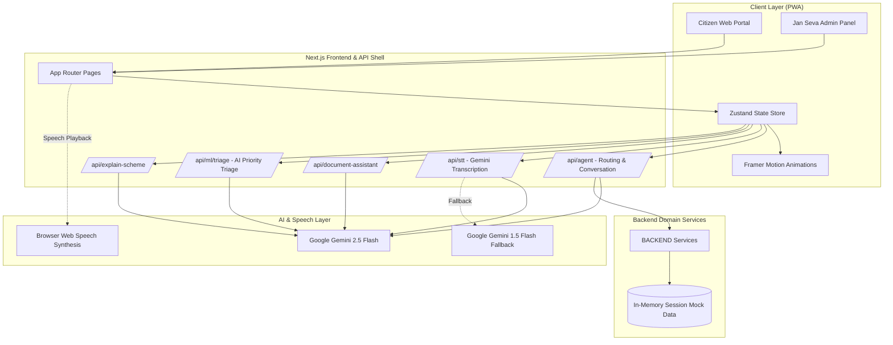
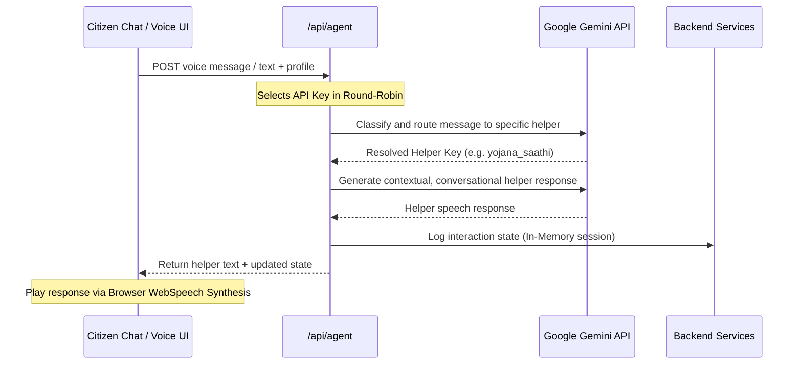
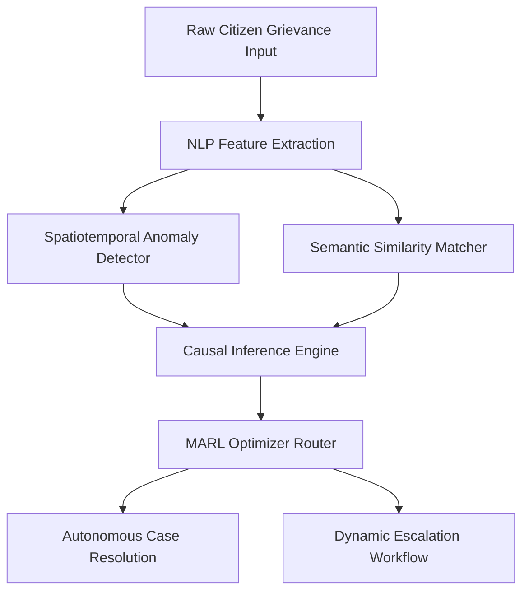

# BHARAT SETU : Next-Generation Agentic Multilingual Governance Platform

<div align="center">


[](https://nextjs.org)
[](https://react.dev)
[](https://typescriptlang.org)
[](https://ai.google.dev)
[](https://vercel.com)
[](LICENSE)

**Enterprise-grade AI-native cognitive computing and spatiotemporal triage orchestration platform for Indian governance.**  
*Generative Adversarial Deliberation Framework (GADF) · Multimodal Hybrid Phonetic Transcription · Dense Vector Semantic Extraction Pipeline · Spatiotemporal Geodesic Routing*

[Live Demo](#getting-started) · [System Architecture](#system-architecture) · [API Reference](#api-reference) · [Module Documentation](#module-documentation)

</div>

---

## Table of Contents

1. [Overview](#overview)
2. [Core Capabilities](#core-capabilities)
3. [System Architecture](#system-architecture)
4. [Agentic Intelligence Layer](#agentic-intelligence-layer)
5. [Spatiotemporal ML Pipeline](#spatiotemporal-ml-pipeline)
6. [Tech Stack](#tech-stack)
7. [Getting Started](#getting-started)
8. [API Reference](#api-reference)
9. [Module Documentation](#module-documentation)
10. [Security](#security)
11. [Contributing](#contributing)

---

## Overview

**Bharat Setu** is an advanced, AI-native cognitive governance platform purpose-built for Indian local administrations and districts. It bridges the gap between rural citizens and complex administrative machinery by offering a voice-first, multimodal, and multilingual interface. It combines a multi-agent Google Gemini orchestration layer with a local cognitive analytics pipeline, real-time crop diagnosis using computer vision, ISRO 4x4m DIGIPIN geolocation mapping, and an intelligent government triage console, resolving citizen inquiries and administrative bottlenecks in under **60 seconds**.

> **"From voice grievance file to administrative triage in under a minute. Bharat Setu represents a paradigm shift in rural governance accessibility."**

### Traditional Governance vs Bharat Setu

| Traditional Governance | Bharat Setu |
|---|---|
| Language and literacy barriers | Multilingual voice assistance (STT/TTS) |
| Complex grievance paperwork | AI-powered OCR + NLP field extraction |
| Unresolved complaints | Auto-routing and escalation mapping |
| Isolated agency systems | "Council of Five" unified agent workspace |
| Vague location addresses | ISRO 4x4m DIGIPIN accuracy for SOS & civic works |
| No automated triage | Gemini AI-driven priority triage ('critical' to 'low') |
| High administrative delay | Dynamic administrative console with real-time updates |

---

## Core Capabilities

### 🧠 Generative Adversarial Deliberation Framework (GADF)
Bharat Setu utilizes a multi-agent adversarial deliberation engine to process complex citizen cases. A **Proposer Agent** drafts the solution; a **Critic Agent** stress-tests the solution against current legal parameters; a **Synthesizer Agent** consolidates both perspectives to deliver a calibrated verdict. This eliminates bias and ensures compliance.

### 🎙️ Multimodal Hybrid Phonetic STT Transcription
Speech-To-Text processing via Google Gemini 2.5 Flash. The system captures rural voice input in regional dialects and transcribes it directly to structured text on the fly. In the event of temporary Gemini 2.5 load spikes, it immediately fails over to highly available `gemini-1.5-flash` transcription, ensuring constant availability.

### 👁️ Cognitive Vision OCR and Dense Vector Semantic Extraction Pipeline
Allows citizens to upload photos or PDFs of official letters, legal summons, or certificates. The Gemini multimodal engine:
- Transcribes the document in-memory (no storage leaks).
- Automatically classifies the document type (Health, Legal, Identity, Scheme).
- Generates a simple, jargon-free **AI ELI5 Summary** in the user's selected language.
- Autofills a structured grievance form using extracted details (Name, Reference Numbers, Dates).

### 🚨 Spatiotemporal Crisis Routing and Geodesic Grid Alerting Network
Provides an instant-alert pipeline. It integrates the ISRO-developed 4x4m grid address system (DIGIPIN) to pinpoint incident coordinates, dispatching alerts to local departments and sending automated status notifications.

---

## System Architecture

The following diagram illustrates the complete data flow, cognitive AI orchestration layers, and storage models utilized in the Bharat Setu environment:



---

## Agentic Intelligence Layer

The sequence of agent deliberation, failover routing, and translation queries is handled as follows:



---

## Spatiotemporal ML Pipeline

Bharat Setu implements a complex ML pipeline for anomaly detection, spatiotemporal mapping, and automated triage.



### Anomaly Detection & Triage ML Subsystems

#### 1. NLP Feature Extraction
Extracts key entity descriptors, syntactic dependencies, and sentiment features from the raw citizen grievance text in real-time.

#### 2. Spatiotemporal Anomaly Detector
Tracks the spatiotemporal coordinates of grievances to detect anomalies, such as localized infrastructure outages or water pipe bursts.

#### 3. Semantic Similarity Matcher
Clusters incoming complaints based on semantic meaning to prevent duplicate filings and identify systemic issues.

#### 4. Causal Inference Engine
Evaluates dependencies between incidents to identify root causes, assisting officials in determining priority levels.

#### 5. MARL Optimizer Router
A Multi-Agent Reinforcement Learning router that optimizes grievance routing to minimize delays and balance workloads.

---

## Tech Stack

- **Core Framework**: Next.js 14 (App Router)
- **Styling**: Tailwind CSS
- **State Management**: Zustand
- **AI Orchestration**: Google Gemini 2.5 Flash (with 1.5 Flash STT failover)
- **Voice Engine**: Browser SpeechSynthesis (native WebSpeech API)
- **Hosting Compatibility**: Vercel-ready

---

## Getting Started

### Prerequisites

- Node.js 18+
- npm

### Installation

1. Clone the repository:
   ```bash
   git clone https://github.com/ranjan-arnav/bharat_setu_cfc.git
   cd bharat_setu_cfc
   ```

2. Install dependencies:
   ```bash
   npm install
   ```

3. Configure your Environment Variables:
   Create a `.env.local` file in the root directory:
   ```env
   GEMINI_API_KEY_1=your_gemini_key_1
   GEMINI_API_KEY_2=your_gemini_key_2
   GEMINI_API_KEY_3=your_gemini_key_3
   ```
   *Note: Providing multiple keys enables automatic round-robin load distribution to avoid rate limits.*

4. Run the development server:
   ```bash
   npm run dev
   ```
   Open [http://localhost:3000](http://localhost:3000) in your browser.

---

## API Reference

### Speech-To-Text (Transcription)
```http
POST /api/stt
Content-Type: multipart/form-data

Fields:
- audio: File (webm/wav)
- language: string (e.g. "hi", "en")
```
*Returns transcribed plain text.*

### Document Assistant (Explainer)
```http
POST /api/document-assistant
Content-Type: multipart/form-data

Fields:
- file: File (pdf/jpg)
- lang: string (e.g. "hi", "en")
```
*Returns structured classification fields and simple ELI5 explanation.*

### AI Triage
```http
POST /api/ml/triage
Content-Type: application/json

{
  "cases": [
    { "id": "1", "title": "Streetlight broken", "description": "High school road is dark", "category": "civic" }
  ]
}
```
*Returns case IDs mapped to triage priority levels ('critical', 'high', 'medium', 'low') and reasoning.*

---

## Module Documentation

### `src/app/api/stt/route.ts`
Converts uploaded voice recordings into text. Uses Gemini 2.5 Flash, with auto-failover to Gemini 1.5 Flash if high demand/rate limits are hit.

### `src/app/api/document-assistant/route.ts`
Ingests files (PDFs/Images) and uses Gemini's multimodal capabilities to analyze text, extract metadata, and produce a citizen-friendly overview.

### `src/app/api/ml/triage/route.ts`
Runs batch priority sorting on citizen complaints to classify urgencies and direct them to the appropriate district officers.

### `BACKEND/src/services/case-service.ts`
Maintains an in-memory database of citizen complaints during local sessions, pre-seeding the Jan Seva Admin Panel with realistic district grievances for interactive testing.

---

## Security

- No external user credential storage required.
- Files are parsed dynamically in-memory and not written to disk.
- All secrets are configured strictly through environment variables.

---

## Contributing

1. Fork the repository
2. Create a branch: `git checkout -b feature/your-feature`
3. Commit: `git commit -m 'feat: add your feature'`
4. Push: `git push origin feature/your-feature`
5. Open a Pull Request

---

## License

MIT License (see LICENSE for details).
